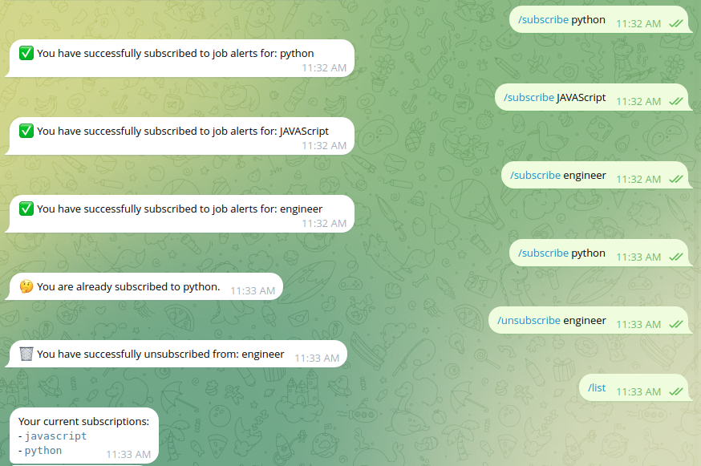

# 🤖 Telegram Job Alert Scraper Bot


A highly modular and scalable Telegram bot designed to automate the job search process. The bot scrapes job boards for new listings, filters them based on user-defined keywords, and delivers real-time alerts directly to subscribed users.

This project was built not just to be functional, but to serve as a showcase of production-ready code, clean architecture, and modern development practices.

***

### 📸 Bot in Action

Here is a glimpse of the bot's user interface and core functionality.

**1. Welcome & Onboarding**  
*A clean, welcoming message guides the user on how to use the bot from the very beginning.*


**2. Easy Subscription Management**  
*Users can effortlessly subscribe, unsubscribe, and list their job keywords with simple commands.*


**3. Instant Job Notifications**  
*Matching jobs are delivered instantly in a well-formatted message, complete with a direct link to the job posting.*


***

### 📋 Table of Contents

1.  [The Goal Behind The Project](#-the-goal-behind-the-project)
2.  [🚀 Key Features & Strengths](#-key-features--strengths)
3.  [🛠️ Tech Stack & Tools](#️-tech-stack--tools)
4.  [🏛️ System Architecture](#️-system-architecture)
5.  [🏁 Getting Started: Local Setup](#-getting-started-local-setup)
6.  [⚙️ How to Use the Bot](#️-how-to-use-the-bot)
7.  [🧩 Architectural Deep Dive: Adding a New Scraper](#-architectural-deep-dive-adding-a-new-scraper)
8.  [☁️ Deployment Guide](#️-deployment-guide)
9.  [✨ Future Enhancements](#-future-enhancements)
10. [📄 License](#-license)

***

### 🎯 The Goal Behind The Project

The primary goal was to architect a system that is robust, maintainable, and easily extendable. Many scraping projects are written as simple, monolithic scripts that are difficult to update when a target website changes its layout.

This project solves that problem by adhering to key software design principles:

*   **Separation of Concerns**: Each component (`bot`, `handlers`, `scraper`, `database`) has a single, well-defined responsibility.
*   **Modularity**: The scraper engine is designed in a "plug-and-play" fashion. Adding a new job board to scrape is a simple, isolated task that requires no changes to the core application logic.
*   **Scalability**: The asynchronous architecture using `asyncio` and `aiogram` ensures the bot can handle a large number of users and concurrent operations efficiently without blocking.
*   **Configuration over Code**: Critical data points like API keys and website CSS selectors are externalized into configuration files, allowing for easy updates without touching the business logic.

***

### 🚀 Key Features & Strengths

*   **👨‍💻 User Keyword Subscriptions**: Allows users to subscribe and unsubscribe to multiple job keywords (e.g., "Python", "Technical Writer").
*   **🤖 Automated Daily Scraping**: A reliable scheduler runs once a day to fetch the latest job postings from multiple sources.
*   **🔌 Plug-and-Play Scraper Architecture**: The system automatically discovers and runs any new scraper module placed in the `scrapers/` directory. This makes the bot incredibly easy to extend.
*   **💡 Duplicate Prevention**: The bot maintains a record of every job alert sent, ensuring users never receive the same notification twice.
*   **🌐 Multi-Source Scraping**: Capable of scraping both traditional HTML websites (with BeautifulSoup) and modern JavaScript-driven sites via their hidden JSON APIs.
*   **🗃️ Persistent SQLite Database**: User subscriptions and job history are stored reliably in a local SQLite database.
*   **⚡ Fully Asynchronous**: Built from the ground up with `asyncio`, `aiogram`, and `httpx` for high performance and non-blocking I/O.

***

### 🛠️ Tech Stack & Tools

| Category          | Technology                                                                                                  |
| ----------------- | ----------------------------------------------------------------------------------------------------------- |
| **Bot Framework** | [**`aiogram 3`**](https://docs.aiogram.dev/en/latest/) - A modern, fully asynchronous framework for Telegram bots. |
| **Web Scraping**  | [**`httpx`**](https://www.python-httpx.org/) + [**`BeautifulSoup4`**](https://www.crummy.com/software/BeautifulSoup/bs4/doc/) |
| **Database**      | [**`SQLite`**](https://www.sqlite.org/index.html) via [**`aiosqlite`**](https://github.com/omnilib/aiosqlite) for async access. |
| **Scheduling**    | [**`APScheduler`**](https://apscheduler.readthedocs.io/en/3.x/) - For scheduling the daily scraping jobs.          |
| **Configuration** | [**`python-dotenv`**](https://github.com/theskumar/python-dotenv) - For managing environment variables.           |
| **Language**      | **Python 3.11+**                                                                                            |

***

### 🏛️ System Architecture

The system is composed of several decoupled services that communicate with each other to fulfill the bot's purpose.

```mermaid
graph TD
    A[User] -- Telegram Commands --> B{Telegram API}
    B -- Updates --> C[Aiogram Bot]
    C -- Handles Commands --> D[Command Handlers]
    D -- add/remove/list --> E[Database (SQLite)]

    subgraph Scheduled_Daily_Job
        F[Scheduler (APScheduler)] -- Triggers --> G[Scraper Orchestrator]
        G -- Gets Keywords --> E
        G -- Runs Scrapers --> H[Scraper Modules]
        H -- Fetches Data --> I[Job Boards (Web/API)]
        I -- Returns Data --> H
        H -- Returns Parsed Jobs --> G
    end

    G -- Matches Jobs & Users --> J[Job Processor]
    J -- Checks History --> E
    J -- Sends Alerts --> C
    J -- Saves Sent Jobs --> E
    C -- Delivers Message --> B
    B -- Sends Notification --> A
```

***

### 🏁 Getting Started: Local Setup

Follow these steps to get the bot running on your local machine.

#### 1. Prerequisites
- Python 3.11 or newer.
- A Telegram account.

#### 2. Get a Telegram Bot Token
1.  Chat with the [`@BotFather`](https://t.me/BotFather) on Telegram.
2.  Send the `/newbot` command and follow the instructions.
3.  Once your bot is created, BotFather will give you a unique **API Token**. Copy it.

#### 3. Clone & Install
```bash
# Clone the repository
git clone https://github.com/C-EB/job-alert-bot.git
cd job-alert-bot

# Create and activate a virtual environment
python -m venv venv
source venv/bin/activate  # On Windows: venv\Scripts\activate

# Install the required dependencies
pip install -r requirements.txt
```

#### 4. Configure Environment Variables
1.  Create a file named `.env` in the root of the project directory.
2.  Add your Telegram Bot Token to this file:
    ```
    TELEGRAM_BOT_TOKEN="YOUR_TELEGRAM_BOT_TOKEN_HERE"
    ```

#### 5. Run the Bot
```bash
python bot.py
```
Your bot is now live! You can find it on Telegram and start using the commands.

***

### ⚙️ How to Use the Bot

Interact with your bot on Telegram using these commands:

-   `/start` - Displays the welcome message and instructions.
-   `/subscribe <keyword>` - Subscribes you to job alerts for a specific keyword (e.g., `/subscribe Python`).
-   `/unsubscribe <keyword>` - Removes a keyword subscription.
-   `/list` - Shows all your current subscriptions.
-   `/help` - Provides a detailed usage guide.

***

### 🧩 Architectural Deep Dive: Adding a New Scraper

The bot's modular design makes adding new job boards incredibly simple.

**Goal**: Add a scraper for a new site, `newjobsite.com`.

**Step 1: Add Configuration in `selectors.py`**

Define the URL and CSS selectors for the new site. The system will use these to fetch and parse the data.

```python
# In selectors.py
SELECTORS = {
    # ... existing sites
    "newjobsite": {
        "type": "html",
        "url": "https://newjobsite.com/jobs?q={keyword}",
        "job_card": "div.job-listing",
        "title": "h3.job-title",
        "company": "p.company-name",
        "link": "a.view-details",
        "id_attribute": "data-job-id"
    }
}
```

**Step 2: Create a New Scraper Module**

Create a new file `scrapers/newjobsite.py`. This file must contain an `async def scrape(...)` function that takes the HTML and selectors, and returns a list of job dictionaries.

```python
# In scrapers/newjobsite.py
import logging
from bs4 import BeautifulSoup

async def scrape(html: str, selectors: dict):
    soup = BeautifulSoup(html, 'html.parser')
    jobs = []
    for card in soup.select(selectors['job_card']):
        # ... (logic to find title, company, link) ...
        job = {
            "id": f"newsite_{card.get(selectors['id_attribute'])}",
            "title": ...,
            "company": ...,
            "link": ...,
            "source": "NewJobSite"
        }
        jobs.append(job)
    return jobs
```

**That's it!** The next time the daily job runs, the orchestrator in `scraper.py` will automatically discover, import, and execute your new scraper without any other code changes.

***

### ☁️ Deployment Guide

This application is ready for deployment on any platform that supports Python:
- **PaaS (Platform as a Service)**: Recommended for ease of use.
  - **Railway**: Deploy directly from your GitHub repository. Set the `TELEGRAM_BOT_TOKEN` as an environment variable in the Railway dashboard.
  - **Render**: Similar to Railway, offers a free tier for services.
- **VPS (Virtual Private Server)**: For more control.
  - **DigitalOcean, Linode, AWS EC2**: You would typically run the bot as a `systemd` service or inside a `Docker` container to ensure it runs continuously.

The command to start the application on any platform is `python bot.py`.

***

### ✨ Future Enhancements

This project has a solid foundation that can be extended with many professional features:
-   **Dockerization**: Package the application into a Docker container for perfectly reproducible deployments.
-   **Advanced Keyword Matching**: Implement NLP (Natural Language Processing) to match keywords against the full job description, not just the title.
-   **Interactive UI**: Use Telegram's inline keyboards for a more user-friendly experience (e.g., buttons to unsubscribe or view jobs).
-   **Web Dashboard**: Create a simple web interface with Flask or FastAPI to display bot statistics and analytics.
-   **Proxy Integration**: Add support for using HTTP proxies to avoid being blocked by job sites during scraping.
